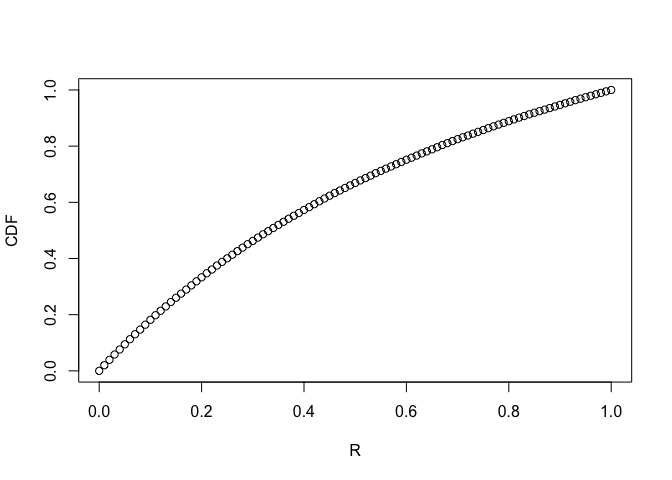

Broken Stick Problem
================

Problem
-------

> A stick of length 1 is broken at a uniformly random point, yielding two pieces. Let X and Y be the lengths of the shorter and longer pieces, respectively, and let R = X=Y be the ratio of the lengths of X and Y.
>
> 1.  Find the CDF and PDF of R.
> 2.  Find the expected value of R (if it exists).
> 3.  Find the expected value of 1/R (if it exists).

-   Introduction to Probability (J. Blitzstein), Exercises 5.10, Problem 13.

Solution
--------

### Setup

We can set up a function that can simulate the behaviour of R:

``` r
short_by_long <- function(len) {
  # Given the length of one piece of the stick (originally of length 1), 
  # Return the ratio of the shorter piece to the longer piece
  
  shorter <- min(len, 1 - len)
  longer <- 1 - shorter
  
  shorter/longer
}
```

### CDF of R

Calculating the CDF and PDF is tricky for continuous variables. We can visualize the CDF by generating multiple values of R, and then plotting the CDF:

``` r
num_iterations <- 10^5

# Generate 10^5 uniform numbers, 
# which are interpreted as an arbitrary piece of a unit stick broken into 2
x <- runif(num_iterations)

# Generate values of R
r_sample <- sapply(x, short_by_long)

# How many segments to divide the range of R into
divisions <- 100

# cdf[i] actually contains the value of cdf[i/100]
# So cdf[5] is the value of F(0.05)
cdf <- rep(0, 1 + divisions)

x_vals <- seq(0, 1, 1/divisions)

k <- 1
for (i in x_vals) {
  cdf[k] <- mean(r_sample < i)
  k <- k + 1
}

plot(x = x_vals, y = cdf, xlab = "R", ylab = "CDF")
```



The theoretical formula for the CDF of R turns out to be 2x/(1 + x), after solving the problem statement. We can plot this on top of the experimental plot to determine how correct the simulation was:

``` r
expected_cdf <- function(x) {
  2*x/(1 + x)
}

y_vals <- sapply(seq(0, 1, 0.01), expected_cdf)

plot(x = x_vals, y = cdf, xlab = "R", ylab = "CDF")
lines(x = seq(0, 1, 0.01), y=y_vals, col="red", lwd = 2)

legend("topleft", legend = c("Experimental", "Theoretical"), pch = c(1, 45), col=c("black", "red"))
```


Our simulation appears to have given the correct results!

### Expected Value of R

This is fairly easy to calculate at this point:

``` r
mean(r_sample)
```

    ## [1] 0.3849215

To verify this, we can solve the expression for E(X) by integrating the PDF under appropriate limits, and finally we arrive to the value of ln(4) - 1

``` r
log(4) - 1
```

    ## [1] 0.3862944

Again, our empirical value seems to be extremely close to the actual value.
