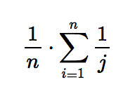
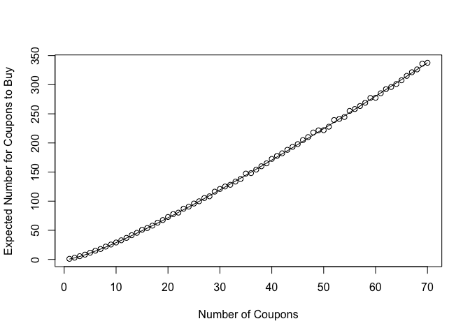

Coupon Collector Problem
================

Problem Statement
-----------------

> Suppose there are n types of toys, which you are collecting one by one, with the goal of getting a complete set. When collecting toys, the toy types are random (as is sometimes the case, for example, with toys included in cereal boxes or included with kids’ meals from a fast food restaurant). Assume that each time you collect a toy, it is equally likely to be any of the n types. What is the expected number of toys needed until you have a complete set?

-   Introduction to Probability (J. Blitzstein), Example 4.3.11

Solution
--------

We write a function that performs a single simulation, for a given number of coupons, n. It returns the number of attempts it took to collect all of them.

``` r
coupon_collector_simulation = function(n) {
  collected_coupons <- c()
  
  attempts <- 0
  
  while (length(collected_coupons) != n) {
    # Generate a new coupon uniformly from 1 to n
    new_coupon <- sample(n, 1)
    
    # Add it to the set of coupons we have
    collected_coupons <- unique(c(collected_coupons, new_coupon))
    
    attempts <- attempts + 1
  }
  
  attempts
}
```

Next, we write a function to run this simulation multiple times, and return the mean (expected) number of attempts it takes to collect all n coupons

``` r
coupon_collector_mean_attempts = function(n, num_iterations=10^3) {
  mean(replicate(num_iterations, coupon_collector_simulation(n)))
}
```

Finally, we write a function that returns the actual expectation. This is derived from the formula:



``` r
actual_expectation_for_coupon_collector = function(n) {
  # This is the E(X) for the coupon collector problem (1/n * (sum(1/j) for j from 1 to n))
  n*(log(n) + 0.577)
}
```

Results and Visualization
-------------------------

Now that everything is in place, let's run some simulations and try to visualize them:

``` r
n <- 70

mean_attempts_for_n <- sapply(1:n, coupon_collector_mean_attempts)
expected <- sapply(1:n, actual_expectation_for_coupon_collector)

plot(mean_attempts_for_n, xlab = 'Number of Coupons', ylab = 'Expected Number for Coupons to Buy')
lines(expected)
```



As we can see, the line (calculated via formula) appears to fit the points (calculated from the simulation).
