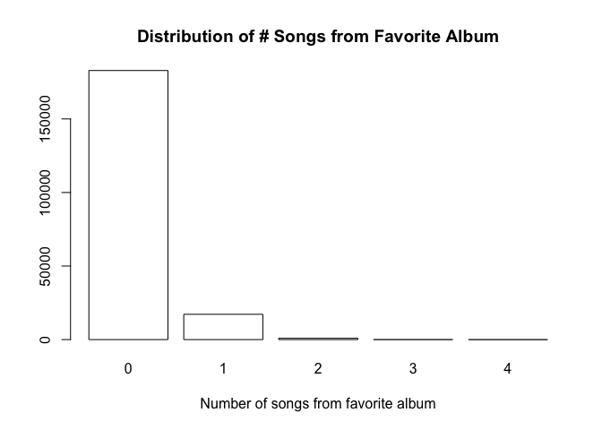
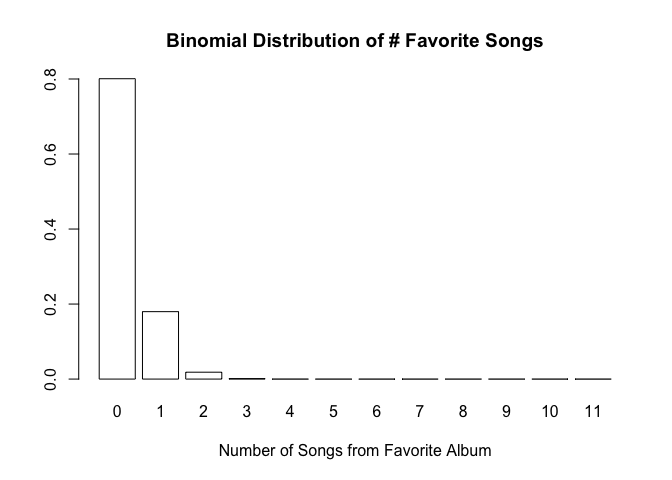

The iPod Song Problem
================

Problem
-------

> Joe’s iPod has 500 different songs, consisting of 50 albums of 10 songs each. He listens to 11 random songs on his iPod, with all songs equally likely and chosen independently (so repetitions may occur).
>
> 1.  What is the PMF of how many of the 11 songs are from his favorite album?
> 2.  What is the probability that there are 2 (or more) songs from the same album among the 11 songs he listens to?

-   Introduction to Probability (J. Blitzstein), Exercises 4.12, Problem 78.

Solution
--------

### The Probability Mass Function

For the PMF, we can use simulations to visually analyze the problem:

``` r
all_songs <- c(rep(1, 10), rep(0, 490))

num_iterations <- 10^5

single_simulation <- function() {
  sum(sample(all_songs, 11, replace = TRUE))
}

experimental_distribution <- tabulate(as.factor(replicate(num_iterations, single_simulation())), nbins=12) / num_iterations

barplot(
  experimental_distribution, 
  xlab = 'Number of songs from favorite album', 
  names.arg = 0:11,
  col = 'white',
  main = 'Distribution of # Songs from Favorite Album'
)
```



Theoretically, this can be thought of as a binomial distribution. We can imagine the 10 favorite songs as successful cases, and the rest as failure. Probability of a song from the favorite album is 10/500 = 0.02. Therefore, P(X = x) = bin(11, 0.02). We can verify this in R:

``` r
theoretical_distribution <- dbinom(x = 0:11, size = 11, prob = 0.02)
barplot(
  theoretical_distribution,
  xlab = 'Number of Songs from Favorite Album', 
  names.arg = 0:11,
  col = 'white',
  main = 'Binomial Distribution of # Favorite Songs'
)
```



Clearly, the experimental and theoretical distributions are identical.

### Probability of 2 or More Songs from the Same Album

The first option is to simply simulate the scenario, and use the empirical result:

``` r
all_songs <- rep(1:50, 10)

has_two_or_more_songs_from_same_album <- function() {
  length(unique(sample(all_songs, 11, replace = TRUE))) != 11
}

num_iterations <- 10^5

simulations <- replicate(num_iterations, has_two_or_more_songs_from_same_album())

probability_of_2_or_more_from_same_album <- sum(simulations) / num_iterations

probability_of_2_or_more_from_same_album
```

    ## [1] 0.69554

We can verify this by using the basic definition of probability, and calculate the probability of no two songs being from the same album. The answer to this question is the complement:
