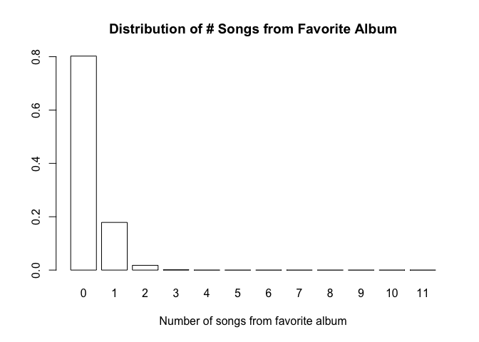

The iPod Song Problem
================

Problem
-------

> Joe’s iPod has 500 different songs, consisting of 50 albums of 10 songs each. He listens to 11 random songs on his iPod, with all songs equally likely and chosen independently (so repetitions may occur).
>
> 1.  What is the PMF of how many of the 11 songs are from his favorite album?
> 2.  What is the probability that there are 2 (or more) songs from the same album among the 11 songs he listens to?

-   Introduction to Probability (J. Blitzstein), Exercises 4.12, Problem 78.

Solution
--------

### The Probability Mass Function

For the PMF, we can use simulations to visually analyze the problem:

``` r
all_songs <- c(rep(1, 10), rep(0, 490))

num_iterations <- 10^6

single_simulation <- function() {
  sum(sample(all_songs, 11))
}

experimental_distribution <- tabulate(replicate(num_iterations, single_simulation()))
print(experimental_distribution)
```

    ## [1] 182917  17190    891     23      1

``` r
barplot(experimental_distribution, 
        xlab = 'Number of songs from favorite album', 
        names.arg = 0:(length(experimental_distribution)-1), 
        col = 'white',
        main = 'Distribution of # Songs from Favorite Album'
        )
```


